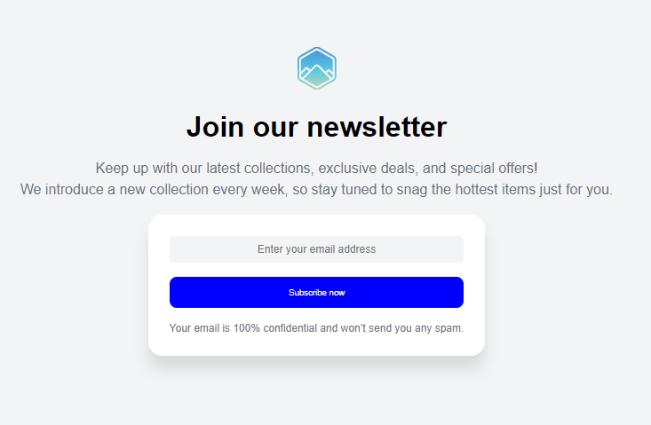

# Join Our Newsletter | devChallenges

Solution for a challenge [Join Our Newsletter](https://devchallenges.io/challenge/join-our-newsletter) from [devChallenges.io](http://devchallenges.io).

[Challenge](https://devchallenges.io/challenge/join-our-newsletter)

## Table of Contents

- [Overview](#overview)
- [Built with](#built-with)
- [Features](#features)
- [How to Use](#how-to-use)
- [Author](#author)

## Overview



This project implements a responsive newsletter subscription component with customizable elements. I created a reusable solution using Web Components with TypeScript, focusing on encapsulation and customizability.

Through this challenge, I improved my skills with:

- Creating reusable web components
- Implementing Shadow DOM for style encapsulation
- Working with TypeScript for type-safe web development
- Using CSS custom properties for theming and customization
- Integrating with backend APIs

## Built with

- Semantic HTML5 markup
- CSS custom properties
- TypeScript
- Web Components (Custom Elements and Shadow DOM)
- CSS Flexbox
- Async/await for API integration

## Features

- Responsive newsletter signup form
- Customizable through attributes and CSS variables
- Encapsulated styles using Shadow DOM
- Clean component architecture with separation of concerns
- API integration for form submission
- Fallback local handling when no API is provided
- Form validation and error handling

## How to Use

To use the components in your project:

1. Include the JavaScript files in your HTML:

    ```html
    <script type="module" src="./dist/subscribe-message.js"></script>
    <script type="module" src="./dist/subscribe-form.js"></script>
    ```

2. Add the components to your HTML:

    ```html
    <!-- Basic usage -->
    <subscribe-message>
      <div slot="message">
        <p>Keep up with our latest collections, exclusive deals, and special offers!</p>
      </div>
      <subscribe-form></subscribe-form>
    </subscribe-message>

    <!-- With custom attributes -->
    <subscribe-message 
      logo-src="custom-logo.svg" 
      logo-alt="Company Logo" 
      title="Stay in the loop">
      <div slot="message">
        <p>Get weekly updates on our latest products and exclusive deals!</p>
      </div>
      <subscribe-form 
        input-placeholder="Your email address" 
        button-text="Sign me up!"
        message="We respect your privacy and won't share your information."
        api-url="https://your-subscription-api.com/subscribe">
      </subscribe-form>
    </subscribe-message>

    <!-- Components can also be used separately -->
    <subscribe-form 
      input-placeholder="Enter email here" 
      button-text="Join now"
      message="No spam, just updates."
      success-message="You're all set! Welcome aboard!"
      error-message="Oops! Something went wrong. Please try again.">
    </subscribe-form>
    ```

3. Customize with CSS variables (optional):

    ```css
    subscribe-form {
      --background-color: #ffffff;
      --box-shadow: 0 1rem 1rem rgba(0, 0, 0, 0.1);
      --border-radius: 1rem;
      --input-border: 1px solid rgb(227, 232, 238);
      --input-border-radius: 0.25rem;
      --input-background-color: rgb(243, 244, 246);
      --input-color: #000;
      --button-background-color: #2860e1;
      --button-color: white;
      --button-border-radius: 0.5rem;
      --button-border: none;
      --message-color: rgb(107, 114, 128);
    }
    
    subscribe-message {
      --text-color: rgb(107, 114, 128);
      --title-color: black;
      --line-height: 1.5rem;
      --max-width: 32rem;
      --font-family: 'Roboto', sans-serif;
      --logo-width: 4rem;
      --logo-height: 4rem;
    }

## Author

- Website [portfolio](https://portfolio-nickescolr.netlify.app)
- GitHub [@NickEsColR](https://github.com/NickEsColR)
